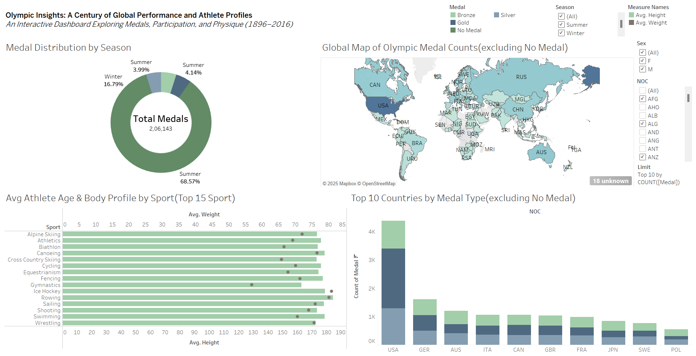

# Olympic Insights: A Century of Global Performance and Athlete Profiles

An interactive Tableau dashboard exploring Olympic medals, participation, and athlete physique from 1896 to 2016.


---

## About the Project

This Tableau dashboard was developed as part of the **B9DA106 Data Visualisation** module at **Dublin Business School (DBS)**, MSc in Data Analytics (2025–26).

The project provides an interactive, visually coherent analysis of 120 years of Olympic history, enabling users to explore medal distributions, national dominance, gender trends, and athlete physical profiles through five interconnected visualizations.

**Key Questions Addressed**

- Which countries have historically dominated the Olympics?
- How do athlete physical characteristics vary by sport?
- What are the seasonal and gender-based trends in medal distribution?

---

## Dashboard Preview



> Live Dashboard: [View on Tableau Public](#) *(Add your Tableau Public link here)*

---

## Project Structure

```
olympic-insights-tableau/
│
├── 20063083Visualization_CA_01.twbx   # Tableau packaged workbook (includes data)
├── olympic_athletes_final.csv          # Cleaned dataset used for visualizations
├── Dashboard.png                       # Dashboard screenshot
├── Critical_Analysis_Report.pdf        # Full critical analysis report
└── README.md
```

---

## Dashboard Components

### 1. Global Map of Olympic Medal Counts
A choropleth map displaying medal distribution by country using a sequential Miller Stone gradient. Filters by decade, season, and gender reveal geopolitical shifts in performance over time.

### 2. Medal Distribution by Season
A donut chart comparing Summer versus Winter Games medal counts. The central space displays the total medal count of 2,06,143. Summer Games account for over 83% of all medals.

### 3. Average Athlete Age and Body Profile by Sport
A dual-axis combination chart where bars represent average height and dots represent average weight across the top 15 sports. The chart highlights physique differences between sports such as Rowing and Gymnastics.

### 4. Top 10 Countries by Medal Type
A horizontal stacked bar chart breaking down Gold, Silver, and Bronze medal counts per nation. The USA leads all categories, while Australia demonstrates a notably high medal-per-athlete ratio.

### 5. Interactive Filters
Synchronized filters for Medal Type, Season, Sex, NOC, and Limit are applied across all worksheets simultaneously, enabling multidimensional exploration of the dataset.

---

## Design Choices

| Element | Choice | Rationale |
|---------|--------|-----------|
| Color Palette | Miller Stone | Earthy, neutral tones — professional and accessible |
| Map Type | Choropleth (Filled Map) | Best suited for geographic comparison |
| Season Chart | Donut Chart | Central space utilized for total count display |
| Body Profile | Dual-Axis Combo Chart | Two metrics presented within one compact visual |
| Medal Chart | Horizontal Stacked Bar | Efficient for proportional ranking comparison |
| Typography | Minimal labels | Maximizes data-ink ratio per Tufte's principle |

---

## Dataset

| Property | Detail |
|----------|--------|
| Source | [Kaggle — 120 Years of Olympic History](https://www.kaggle.com/datasets/heesoo37/120-years-of-olympic-history-athletes-and-results) |
| Records | 270,000+ athlete entries |
| Coverage | 1896 – 2016 |
| Key Fields | Name, Age, Height, Weight, Sex, Team, NOC, Year, Season, Sport, Medal |

**Data Cleaning Steps**

- Null Medal values replaced with "No Medal" for clean aggregation
- Redundant columns removed to streamline analysis
- Decade column derived for temporal grouping
- NOC codes unified (e.g., USSR consolidated for post-Soviet consistency)
- Numeric fields (Age, Height, Weight) standardized for accurate averaging

---

## Key Findings

- The USA dominates overall and gold medal counts across all eras
- Summer Games represent over 83% of total medals due to a larger number of events
- Rowing and Swimming athletes record the highest average height and weight; Gymnastics athletes the lowest
- Women's participation grows significantly post-1970s, reflecting global gender equality reforms
- Africa and South America show gradual improvement in representation, particularly post-1980s
- Australia demonstrates exceptionally high medal efficiency relative to its population size

---

## How to Open the Dashboard

**Option 1 — Tableau Desktop**

1. Download and install [Tableau Desktop](https://www.tableau.com/products/desktop) or the free [Tableau Public](https://public.tableau.com/) application
2. Clone or download this repository
3. Open `20063083Visualization_CA_01.twbx` in Tableau
4. The dataset is embedded within the workbook — no additional setup is required

**Option 2 — Tableau Public (Online)**

Visit the live dashboard link listed above. No installation is required; the dashboard is fully interactive in the browser.

---

## Report

The full Critical Analysis Report is included as `Critical_Analysis_Report.pdf` and covers the following:

- Data preprocessing methodology
- Design justification for each chart type
- Color theory and accessibility considerations
- Key analytical insights and findings
- Evaluation of interactivity and filter design

---

## Author

**Aswin Vaduvana Babu**

- Programme: MSc in Data Analytics, Dublin Business School (DBS)
- Student Number: 20063083
- Submission Date: November 2025
- Module: B9DA106 Data Visualisation
- Lecturer: Kunwar Madan

---

## License

This project is licensed under the [MIT License](LICENSE).

---

## Acknowledgements

- Dataset sourced from [Kaggle](https://www.kaggle.com/datasets/heesoo37/120-years-of-olympic-history-athletes-and-results)
- Developed as part of MSc coursework at Dublin Business School
- Visualization built using Tableau Desktop
